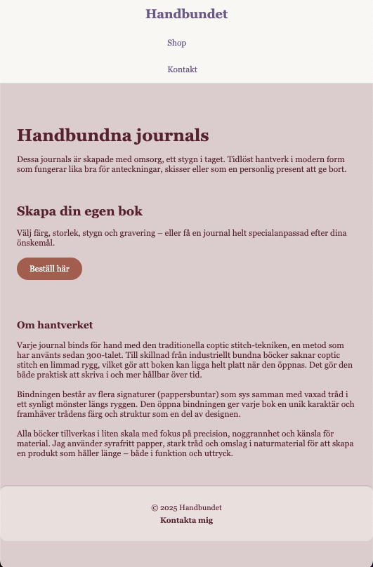
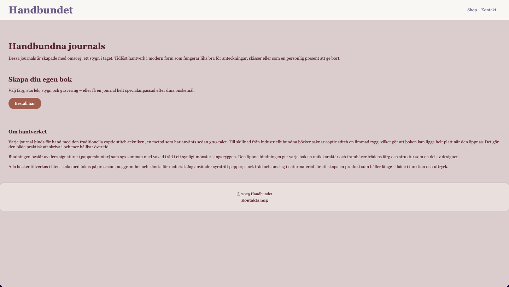

# Projektbeskrivning

Mitt projekt är en webbshop för handbundna, specialdesignade journaler. Eftersom jag bokbinder som hobby ser jag detta projekt som en möjlighet att öva på att bygga en shop inför en eventuell framtida verksamhet.

## Responsivitet
* Media queries
* Flexbox
* Hover, fokus och transitions

## Begränsningar och förbättringsförslag
* Göra shoppen i formulär form
* Använda hamburgar meny för mobilvyn
* Bilder på journaler med de färgalternativen som finns i shoppen. Bilder på stygnalternativen.
* Att Beställ knappen fungerar
* Ha en fil för delad CSS

## Skärmdumpar

### Mobile

### Desktop

